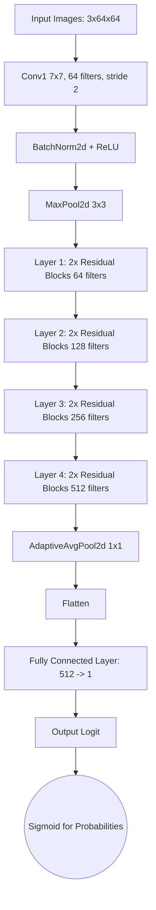

# Model Architecture Description

Our strong lens finder relies on an adapted **ResNet18 (Residual Network)** architecture. The standard ResNet18 is composed of 18 deep layers—primarily stacked Convolutional Operations intermeshed with Batch Normalization, ReLU activations, and core Residual connections that combat vanishing gradients.

## Customization for Lens Classification
Because our input consists of multi-filter arrays of shape `(3, 64, 64)` and we aim to perform binary classification:
1. **Input Map**: The default initial Conv2d layer natively supports 3 input channels, reading the raw lens geometries perfectly.
2. **Intermediate Maps**: Through a sequence of sequential pooling and convolution blocks (`layer1` through `layer4`), spatial dimensions condense while extracting deep feature abstractions (ranging from basic edges to complex galactic shapes).
3. **Classification Head**: The canonical ResNet18 output outputs 1000 features for ImageNet. We swapped the final Fully Connected mapping (`nn.Linear`) to channel down into a singular output node `(1 logit)`. Passing this value through a Sigmoid activation models exactly the likelihood that a strong lens is present.

### Architectural Diagram

*Note: For a visual representation, please refer to the attached `neural_network_visual.png` generated separately.*
