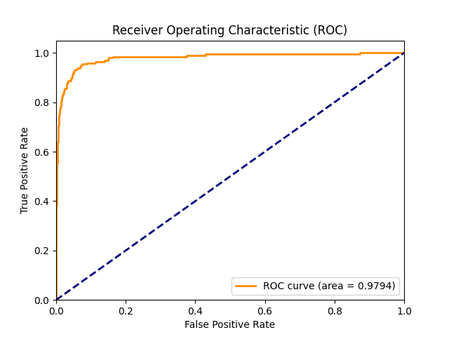

# 🌌 Gravitational Lens Detection Pipeline 

[](https://www.python.org/downloads/)
[](https://pytorch.org/)

A robust, PyTorch-based Deep Learning classification pipeline that identifies strong gravitational lenses in astronomical multi-filter imaging data. The model operates on spatial arrays representing three different optical filters `(3, 64, 64)`.

---

## 📖 Overview

Strong gravitational lensing events are exceedingly rare compared to the vast sea of non-lensed galaxies observable in deep space. Recognizing this extreme **class imbalance**, this pipeline utilizes a customized `ResNet18` backbone fortified with dynamic class weighting inside the Binary Cross-Entropy (BCE) loss function to effectively track down lenses.

## 🚀 Key Features

* **Custom `.npy` Dataloader**: Optimized memory-efficient PyTorch Dataset for loading Numpy binary formats.
* **Auto-Balancing Loss**: Automatically calculates population ratios between `train_lenses` and `train_nonlenses` using `BCEWithLogitsLoss(pos_weight)`. 
* **Model Checkpointing**: Seamlessly saves the `best_model.pth` based on test-set error at the close of every epoch.
* **Evaluation Pipeline**: Generates an authoritative ROC Curve (`roc_curve.png`) natively and calculates Area Under the Curve (AUC).

---

## 🛠️ Project Structure
```text
.
├── dataset.py                # PyTorch Dataset class & DataLoader generation
├── evaluate.py               # Evaluation loop using best_model.pth & Scikit-learn
├── model.py                  # Custom ResNet18 classification backbone
├── train.py                  # Main training loop with BCE pos_weights
├── plot_nn.py                # Matplotlib visualization script for neural architecture
├── MODEL_ARCHITECTURE.md     # Detailed architectural markdown with Mermaid diagrams
├── neural_network_visual.png # High-fidelity schematic map of the neural network
└── lens-finding-test/        # (Ensure data exists here locally)
    ├── train_lenses/         # Positive samples (imbalanced minority class)
    ├── train_nonlenses/      # Negative samples (imbalanced majority class)
    ├── test_lenses/          
    └── test_nonlenses/       
```

---

## 💻 Installation

Clone this repository and ensure all dependencies are established:

```bash
git clone https://github.com/your-username/lens-finding.git
cd lens-finding

# Create a virtual environment (optional but recommended)
python3 -m venv venv
source venv/bin/activate

# Install requirements
pip install torch torchvision numpy scikit-learn matplotlib
```

---

## 🏃‍♂️ Usage

Maintain the `lens-finding-test` dataset within the project's root folder.

### 1. Train the Network
Executing the main script kicks off a fully featured 15-epoch training loop utilizing the `Adam` optimizer (LR=1e-4). Data augmentation (e.g. `RandomHorizontalFlip`) is aggressively applied to broaden the sample generalizability.

```bash
python3 train.py
```
> **Note**: The console will actively stream Training & Validation Loss, persistently validating and saving the strongest generalization weights as `best_model.pth`.

### 2. Evaluate the Checkpoint
Run predictions exclusively on the isolated, unseen samples inside `test_lenses` and `test_nonlenses`.
```bash
python3 evaluate.py
```
This produces the formal metric output to standard-out and drops a pristine `roc_curve.png` visual image into your directory.

---

## 📊 Performance Benchmark

Despite the intense positive-class scarcity across astronomically enormous search areas, the resilient ResNet mapping correctly flags target gravitational lensing properties versus cosmic backgrounds.

- **ROC-AUC Score Evaluated:** `0.9794`

<p align="center">
  
</p>
